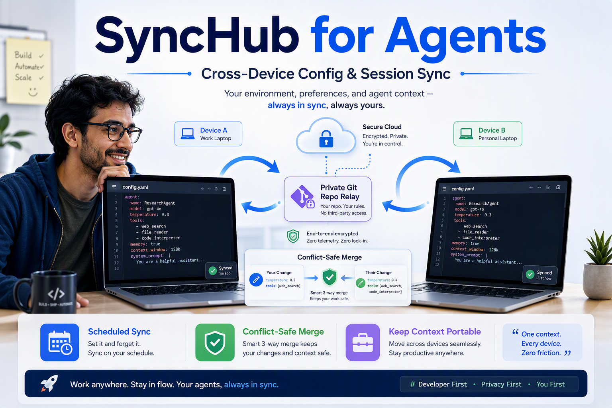

# SyncHub for Agents



SyncHub for Agents is a desktop tray app that keeps AI agent configuration and session data synchronized across multiple computers.

It uses a private Git repository you control as the synchronization bridge, with strict safety filters so credentials and machine-specific state stay local.

## Core capabilities

- Synchronize agent resources (sessions, config, instructions, skills, plugin declarations).
- Run in the Windows system tray with clear status states: Ready, Updating, Sync complete, Paused, Needs attention.
- Sync periodically in the background and on-demand.
- Propagate deletions across machines with a configurable recovery window.
- Resolve conflicts with local/remote/merged choices and batch apply.
- Review and approve plugin/skill install operations before execution, with explicit retry for failed operations.
- Select which agents and resource categories are included, plus custom resource directories.
- Start automatically at login.
- Check GitHub Releases automatically and securely download Windows x64 updates
  for installation when you quit the app.

## What is synchronized

- Portable session files
- Safe projected configuration fields
- Instructions and skills source files
- Plugin manifests/declarations
- Shared common resources configured for supported agents

## What is never synchronized

- Credentials, API keys, OAuth tokens, keyrings
- Machine IDs and machine-local config fields
- Caches, logs, temp files, test runtimes
- Generated dependencies (for example `node_modules`, virtual environments, `__pycache__`)
- Platform binaries and unsafe large files

See [docs/portable-resources.md](docs/portable-resources.md) for detailed rules.

## Quick start (Windows)

1. Create an empty private GitHub repository.
2. Download the installer from the latest release:
   - `SyncHub-for-Agents-Setup-x64.exe`
3. Install and launch **SyncHub for Agents**.
4. Complete onboarding:
   - connect your private repository,
   - authenticate with SSH or GitHub Device Flow,
   - choose agents to synchronize.
5. Keep the app running in the tray on each computer you want to sync.

Detailed install and onboarding guide: [docs/install.md](docs/install.md).

## Software updates

Starting with v0.3.0, release builds check
[GitHub Releases](https://github.com/jelllove/SyncHub-for-Agents/releases/latest)
at startup and every six hours. Windows x64 automatically downloads the latest
stable installer and verifies its SHA-256 checksum before staging it.
The installer runs after you select **Quit** from the tray, without restarting
the app; alternatively, use **Restart to update** in settings.

Settings also provide **Check for updates** and an automatic-update switch.
Closing the window only hides it in the tray and does not install an update.
macOS, Linux, and Windows ARM64 show a link for manual installation instead.
Development builds do not update themselves. Users on v0.2.3 and earlier must
install v0.3.0 or later manually once to enable this feature.

## Build from source

### Prerequisites

- Go version declared in [go.mod](go.mod)
- Node.js version pinned in [.node-version](.node-version), with npm
- Wails v3 CLI (`wails3`)
- NSIS (`makensis`) for Windows installer packaging

### Useful commands

```powershell
node scripts/dev.mjs setup
node scripts/dev.mjs verify
go test ./...
npm --prefix frontend test
wails3 dev
wails3 package GOOS=windows ARCH=amd64 INSTALL_SCOPE=user
```

See the [development guide](docs/development.md) for reproducible setup, hooks,
maintenance, and documentation checks, and [CONTRIBUTING.md](CONTRIBUTING.md)
before submitting a change.

## Project notes

- Product brand: **SyncHub for Agents**
- Some internal identifiers and file names still use `SyncHub`/`synchub` for compatibility with existing installs and startup registrations.

## Code signing policy

SyncHub for Agents intends to use SignPath Foundation for open-source Windows
code signing. See [docs/code-signing-policy.md](docs/code-signing-policy.md) for
release signing scope, team roles, approval requirements, and privacy behavior.

## License

SyncHub for Agents is released under the [MIT License](LICENSE).
